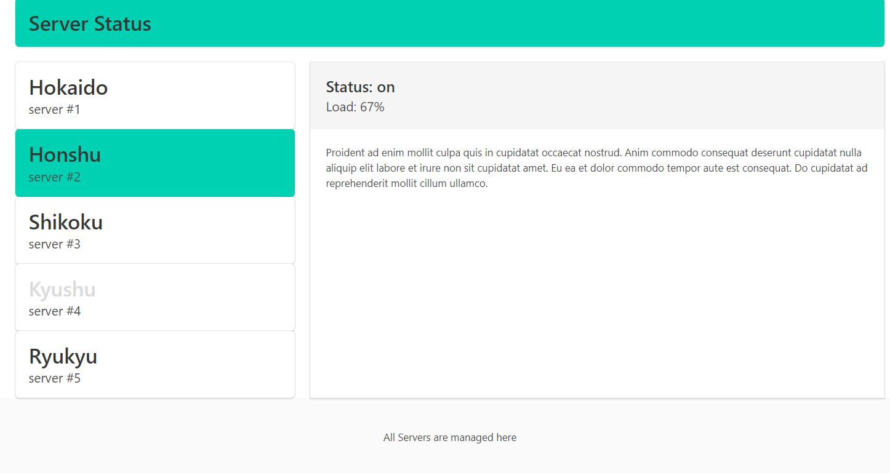

# Vue JS 2  Component Communication Practice

### From Udemy course "Vue JS 2 - The Complete Guide (incl. Vue Router & Vuex)" by Maximilian Schwarzmüller 

Seventh Practice From Section 8 of this course: **Vue Component Communications**

A project created from Node/NPM package *vue.cli* (`vue.cli webpack-simple`)

## Build Setup

``` bash
# install dependencies
npm install

# serve with hot reload at localhost:8080
npm run dev

# build for production with minification
npm run build
```

This practice exercise demonstrates many basic aspects of VueJS based on VueJS `.vue` files

